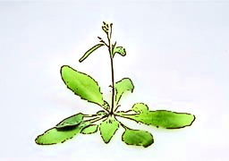
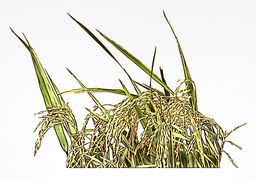
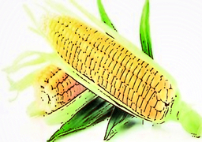
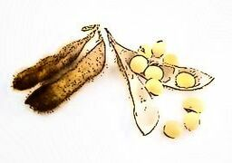

Oligo Database
===============

The oligo database currently hosts oligo sequences of six species, including Arabidopsis, rice, maize, potato, barley and soybean. The details of the oligos are showed in the bellow table.  
To download the oligos, please click the picture of the speices. Details about [Chorus2](#chorus_def), which was used to design the oligos can be found [here](https://github.com/zhangtaolab/Chorus2).

#### Information table

|Species|Scientific name |Reference |No. of oligos |Download|
|---        |---                   |---                                                                   |---          |---     |
|Arabidopsis|*Arabidopsis thaliana*|[TAIR10](https://www.arabidopsis.org/)                                |1,089,367    |[bed](http://jianglab.plantbiology.msu.edu/oligo_database_files/data/TAIR10.bed.bgz)|
|Rice       |*Oryza sativa*        |[TIGR7](http://rice.plantbiology.msu.edu/)                            |1,710,279    |[bed](http://jianglab.plantbiology.msu.edu/oligo_database_files/data/TIGR7.bed.bgz)|
|Maize      |*Zea mays*            |[B73_v4](https://www.maizegdb.org/)                                   |1,641,770    |[bed](http://jianglab.plantbiology.msu.edu/oligo_database_files/data/B73_v4.bed.bgz)|
|Potato     |*Solanum tuberosum*   |[DM_v4.04](http://solanaceae.plantbiology.msu.edu/pgsc_download.shtml)|1,674,902    |[bed](http://jianglab.plantbiology.msu.edu/oligo_database_files/data/DM_v404.bed.bgz)|
|Barley     |*Hordeum vulgare*     |[IBSC_v2](http://plants.ensembl.org/Hordeum_vulgare/Info/Index)       |2,968,560    |[bed](http://jianglab.plantbiology.msu.edu/oligo_database_files/data/IBSC_v2.bed.bgz)|
|Soybean     |*Glycine max*     |[Gmax_ZH13_v2.0](https://bigd.big.ac.cn/gwh/Assembly/652/show)           |1,851,420    |[bed](http://jianglab.plantbiology.msu.edu/oligo_database_files/data/Gmax_ZH13_v3.bed.bgz)|

**Images**

||||
|Arabidopsis|Rice|Maize|
||||
|Potato|Barley|Soybean|

 

#### How to use the database

To use the oligo sequences of the target species, users should first download the *bed* file from the download column in the above table.  
Oligo sequences are provided with *bed.bgz* format, which is a compressed version of bed file. The bed file contains six columns which are separated by delimiter, just like this:  
`chr01   97858   97902   ATTTTCCATGGACCTCATTAAGATTAGCTATTGAACCAGTTACCC   324     +`  
Each column represents chromosome, oligo start site, oligo end site, oligo probe sequence, k-mer score and target strand of probes, respectively.  
Users can decompress the file using 7-Zip software in Windows or the following command in Linux/MacOS:  
`$ bgzip -d xxx.bed.bgz`.  
The decompressed bed file can be opened and read by text editor or Excel easily.
Oligo sequences in the bed file can be synthesized directly for oligo-FISH experiments.  

***

#### <a id="chorus_def" text-decoration="none">Chorus2</a>

[Chorus2](https://github.com/zhangtaolab/Chorus2) is a software which is developed to design genome-scale oligonucleotide-based probes for fluorescence *in situ* hybridization (FISH).  
Chorus2 uses python script Chorus2.py to identify and pre-filter oligos. It is implemented with a "k-mer score" method to remove repetitive oligos of target genome. Chorus2 run fast and can handle large genome like wheat. The oligos designed by Chorus2 has high specificity and suitable for FISH. The Chorus2 package runs on Linux, macOS and Windows with flexible command-line or an easy-to-use GUI (graphical user interface).
